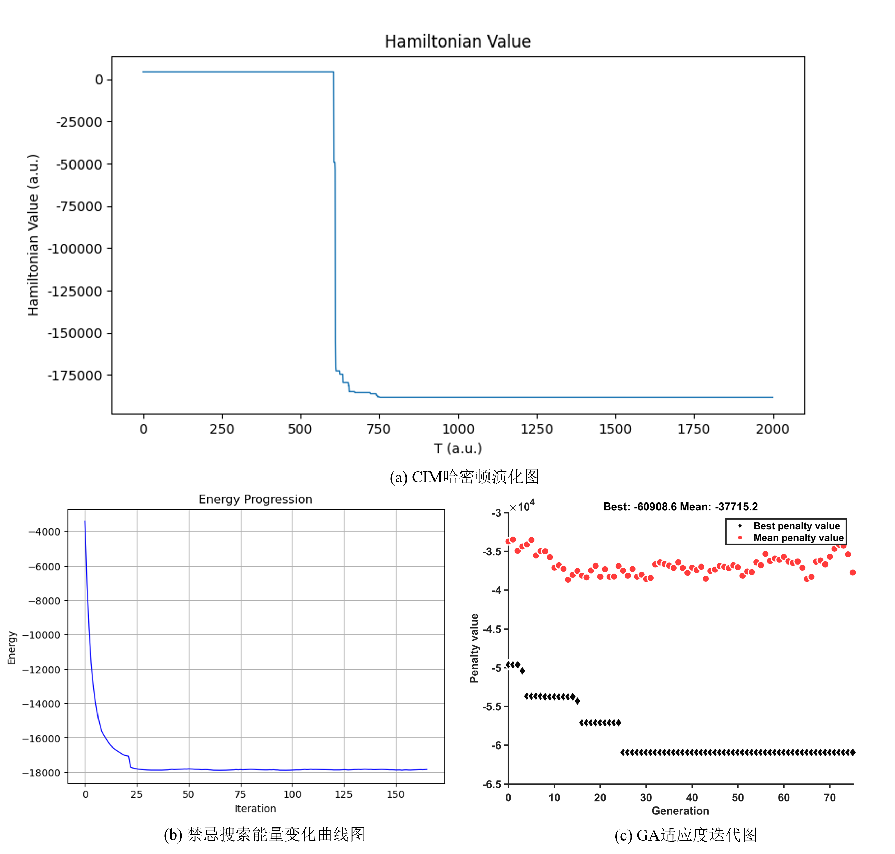
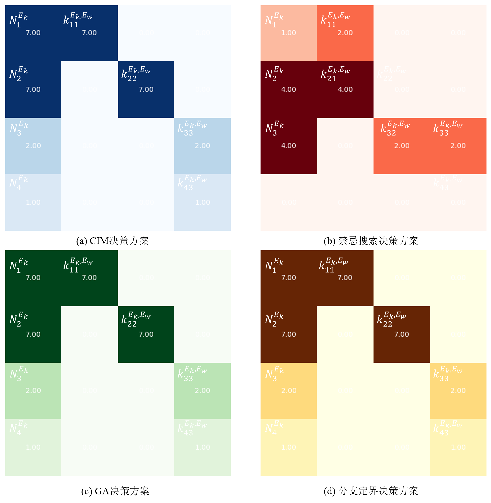
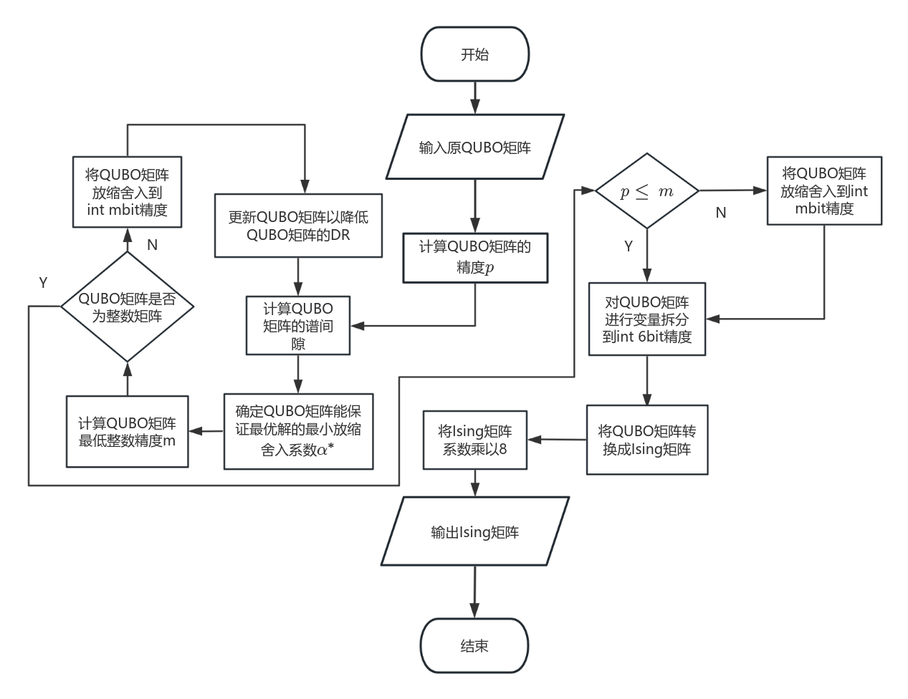

# 基于光量子计算机的智慧矿山设备资源配置优化

## 项目简介
本项目针对**智慧矿山设备资源配置优化问题**，构建带设备协同约束、预算约束、数量约束的混合整数线性规划模型（MILP），通过**QUBO 转换、惩罚函数构造、惩罚系数理论下界计算、Ising 映射、矩阵精度压缩**等完整量子优化流程，最终基于**玻色量子光量子计算机（相干伊辛机 CIM）**实现**毫秒级全局最优求解**。

项目基于**玻色量子 KaiwuSDK** 开发，并在**玻色量子 CPQC-550 光量子真机**完成实验验证，求解速度与最优性显著优于传统算法。

---

## 一、变量含义说明
| 符号 | 含义 |
|------|------|
| $E_k$ | 设备类型（挖掘机） |
| $E_w$ | 设备类型（矿车） |
| $i$ | 设备型号索引 |
| $j$ | 协同设备型号索引 |
| $N_i^{E_k}$ | 第 $k$ 类设备第 $i$ 种配置数量（整数） |
| $I_i^{E_k}$ | 设备型号是否启用（0/1变量） |
| $k_{ij}^{E_k,E_w}$ | 设备 $i$ 分配给设备 $j$ 的协同数量 |
| $C_{ij}^{E_k,E_w}$ | 设备协同配比系数 |
| $p_i^{E_k}$ | 单台设备作业效率 |
| $T(p_i^{E_k})$ | 效率转收益映射 |
| $G(E_k,i)$ | 单类设备总利润 |
| $Pu_i^{E_k}$ | 设备单价 |
| $Ef_i^{E_k}$ | 单位油耗 |
| $Ep_i^{E_k}$ | 人工成本 |
| $Em_i^{E_k}$ | 维护成本 |
| $Y_i^{E_k}$ | 年作业时长 |
| $F(E_k,i)$ | 年总成本 |
| $SuC$ | 总预算 |
| $El_{E_k}$ | 最低设备类型数 |
| $B_j$ | 整数变量二进制化后的二进制变量 |
| $slack$ | 不等式约束松弛变量 |
| $P$ | 惩罚系数 |
| $Q$ | QUBO 模型的系数矩阵 |
| $x$ | 二进制决策变量向量 |
| $x_f$ | 不可行解对应的决策变量向量 |
| $x^*$ | 最优可行解对应的决策变量向量 |
| $x^{**}$ | 次优可行解对应的决策变量向量 |

---

## 二、智慧矿山设备配置 MILP 模型

### 2.1 目标函数（最大化总收益）

$$
max f = SuC - \sum_{k}\sum_i N_i^{E_k}Pu_i^{E_k} + \sum_{k}\sum_i\left[N_i^{E_k}T(p_i^{E_k}) - F(E_k,i)\right]
$$

其中，单类设备年总成本：

$$
F(E_k,i) = (Ef_i^{E_k}+Ep_i^{E_k}+Em_i^{E_k})Y_i^{E_k}N_i^{E_k}
$$

### 2.2 约束条件
1.  设备协同上限约束
   
$$
k_{ij}^{E_k,E_w} \le N_i^{E_k}C_{ij}^{E_k,E_w}
$$
    
2.  矿车数量上限约束
   
$$
\sum_i k_{ij}^{E_k,E_w} \le N_j^{E_w}
$$
    
3.  协同总量平衡约束
   
$$
\sum_j k_{ij}^{E_k,E_w} = N_i^{E_k}
$$
    
4.  最低设备类型约束
   
$$
\sum_i I_i^{E_k} \ge El_{E_k}
$$
    
5.  数量与启用变量关联约束
    
$$
N_i^{E_k} \le MI_i^{E_k},\quad I_i^{E_k} \le N_i^{E_k}
$$
    
6.  总预算约束
    
$$
\sum_{k}\sum_i N_i^{E_k}Pu_i^{E_k} \le SuC
$$

---

## 三、QUBO 模型构建

### 3.1 QUBO 标准形修改说明
为适配量子求解，本研究**将最大化问题转为最小化**，并**将所有约束转化为惩罚项**，因此 QUBO 标准形定义为：

$$
min H_{total} = -f(x) + \sum_{m=1}^6 H_m
$$

- $-f(x)$：将原最大化目标取反，转为最小化问题
- $H_m$：第 $m$ 个约束对应的惩罚项
- $x$：二进制决策变量向量（包含设备数量、启用状态、协同量等所有二进制化后的变量）

### 3.2 整数变量二进制化
所有整数变量（如设备数量 $N_i^{E_k}$）通过二进制展开表示：

$$
n = \sum_{j=1}^d 2^{j-1}B_j,\quad B_j\in\{0,1\}
$$

### 3.3 不等式松弛变量
不等式约束通过引入松弛变量转为等式约束，松弛变量的二进制表示：

$$
slack = \sum_{i=0}^{\lfloor\log_2 k\rfloor-1}2^i slack_i
$$

### 3.4 惩罚项构造原理
对于任意线性约束 $Ax = b$，惩罚项构造为二次形式：

$$
H_{pen} = P (Ax - b)^2
$$

其中 $P$ 为惩罚系数，保证不可行解的目标值一定大于可行解。

### 3.5 6类约束的具体惩罚项
1.  **H1：设备协同上限约束惩罚项**

$$
H_1 = P_1 \left( C_{ij}^{E_k,E_w} \sum B_x^{N_i^{E_k}} - \sum B_z^{k_{ij}^{E_k,E_w}} - s_1 \right)^2
$$

2.  **H2：最低设备类型约束惩罚项**

$$
H_2 = P_2 \left( \sum I_i^{E_k} - El_{E_k} - s_2 \right)^2
$$

3.  **H3：数量与启用变量关联约束惩罚项**
    
$$
H_{31} = P_{31} \left( M I_i^{E_k} - \sum B_x^{N_i^{E_k}} - s_{31} \right)^2
$$

$$
H_{32} = P_{32} \left( \sum B_x^{N_i^{E_k}} - I_i^{E_k} - s_{32} \right)^2
$$

4.  **H4：矿车数量上限约束惩罚项**

$$
H_4 = P_4 \left( N_j^{E_w} - \sum B_z^{k_{ij}^{E_k,E_w}} - s_4 \right)^2
$$

5.  **H5：协同总量平衡约束惩罚项**

$$
H_5 = P_5 \left( \sum B_x^{N_i^{E_k}} - \sum B_z^{k_{ij}^{E_k,E_w}} \right)^2
$$

6.  **H6：总预算约束惩罚项**

$$
H_6 = P_6 \left( SuC - \sum N_i^{E_k}Pu_i^{E_k} - s_6 \right)^2
$$

### 3.6 最终 QUBO 目标

$$
min H_{total} = -f + H_1 + H_2 + H_{31} + H_{32} + H_4 + H_5 + H_6
$$

### 3.7 Q矩阵定义
QUBO 模型可统一表示为：

$$
min H = x^T Q x
$$

其中 $Q$ 为 QUBO 系数矩阵，由两部分组成：
- 目标函数项：由 $-f(x)$ 转换得到的二次项系数
- 惩罚项项：由所有 $H_m$ 转换得到的二次项系数

---

## 四、惩罚系数理论下界

### 4.1 惩罚系数判定核心条件
为保证可行解的目标值一定小于不可行解，惩罚系数必须满足：

$$
P > \frac{\Delta f_{max}}{\Delta penalty_{min}}
$$

### 4.2 目标函数最大变化量 $\Delta f_{max}$
$$
\Delta f_{max} = max_i \left( \sum_{Q_{ij} \ge 0} Q_{ij}, \sum_{Q_{ij} \le 0} Q_{ij} \right)
$$
- $Q_{ij}$：Q矩阵中第 $i$ 行第 $j$ 列的元素
- 物理含义：目标函数项在单位变量变化下的最大差值

### 4.3 惩罚项最小有效变化 $\Delta penalty_{min}$
$$
\Delta penalty_{min} = min_{valid} \left( x_f^T Q_{pen} x_f - x^T Q_{pen} x \right)
$$
- $Q_{pen}$：Q矩阵中对应惩罚项的子矩阵
- $x$：可行解对应的决策变量向量
- $x_f$：不可行解对应的决策变量向量
- 物理含义：不可行解与可行解在惩罚项上的最小差值

### 4.4 最优惩罚系数计算
$$
P^* = \lceil \frac{\Delta f_{max}}{\Delta penalty_{min}} + 1 \rceil
$$


---

## 五、QUBO → Ising 模型映射

### 5.1 变量变换
QUBO 二进制变量 $x_i$ 与 Ising 自旋变量 $\sigma_i$ 的映射关系：

$$
x_i = \frac{\sigma_i + 1}{2},\quad \sigma_i\in\{\pm1\}
$$

### 5.2 系数映射
$$
J_{ij} = \frac{Q_{ij}}{4}
$$
$$
h_i = \frac{Q_{ii}}{2} + \frac{1}{4} \sum_{k \ne i} (Q_{ik} + Q_{ki})
$$

### 5.3 Ising 哈密顿量
$$
H = \sum_{i < j} J_{ij}\sigma_i\sigma_j + \sum_{i} h_i\sigma_i
$$

---

## 六、Ising 矩阵精度降低方法（适配量子硬件）

### 6.1 动态范围
$$
DR = log2( \frac{\overline D}{\breve D} )
$$
- $\overline D$：Q矩阵非零元素的最大差值
- $\breve D$：Q矩阵非零元素的最小差值

### 6.2 谱间隙
$$
\gamma_Q = f(x^{**}) - f(x^{*})
$$
- $f(x^{*})$：最优解的函数值
- $f(x^{**})$：次优可行解的函数值
- 物理含义：最优解与次优解的目标值差值

### 6.3 最优缩放系数
$$
\alpha^* = \frac{n^2 + n}{4 \gamma_Q}
$$
- $n$：Q矩阵的维度

### 6.4 所需比特宽度
$$
m = log2( \alpha^* \overline D )
$$

### 6.5 矩阵缩放取整
$$
Q' = round( \alpha Q )
$$

### 6.6 超 8bit 变量拆分
当矩阵精度超过 CIM 8bit 硬件限制时，通过变量拆分适配：

$$
min f(x,x') + M \sum (x_k - x'_k)^2
$$

---

## 七、实验结果与分析

### 7.1 实验环境
本实验的硬件与软件环境配置如下：
- CPU：12th Gen Intel(R) Core(TM) i7-12650H
- GPU：NVIDIA GeForce RTX 4060 Laptop
- 内存：16GB
- 量子硬件：玻色量子 CPQC-550 相干伊辛机
- 开发框架：玻色量子 KaiwuSDK1.1.2
- python版本：3.8.x

---

### 7.2 算例背景
本算例针对某露天智慧矿山，求解**4类挖掘机与3类矿车的协同作业资源配置优化问题**，目标为实现矿山5年作业周期内的收益最大化。

算例核心设定：
- 作业周期：5年
- 矿车状态：已提前采购，仅需考虑消耗成本
- 矿车保有量：矿1型7辆、矿2型7辆、矿3型3辆
- 最低配置要求：挖掘机至少启用3种型号
- 启动资金上限：2400万元
- 作业时长：每月20天，每天8小时
- 油价：7元/升
- 矿石价格：20元/立方米

#### 挖掘机与矿车协同作业需求表
| 设备型号 | 矿1型 | 矿2型 | 矿3型 |
|----------|-------|-------|-------|
| 挖1型    | 1     | 0     | 0     |
| 挖2型    | 2     | 1     | 0     |
| 挖3型    | 2     | 2     | 1     |
| 挖4型    | 0     | 2     | 1     |

#### 挖掘机相关参数表
| 型号 | 斗容（立方米） | 作业效率（斗/小时） | 油耗（升/小时） | 采购价格（万元） | 人工成本（元/月） | 维护成本（元/月） |
|------|----------------|--------------------|----------------|------------------|------------------|------------------|
| 挖1  | 0.9            | 190                | 28             | 100              | 7000             | 1000             |
| 挖2  | 1.2            | 175                | 30             | 140              | 7500             | 1500             |
| 挖3  | 1.8            | 165                | 34             | 200              | 8500             | 2000             |
| 挖4  | 2.1            | 150                | 38             | 320              | 9000             | 3000             |

#### 矿车相关参数表
| 型号 | 油耗（升/小时） | 人工成本（元/月） | 维护成本（元/月） |
|------|----------------|------------------|------------------|
| 矿1  | 18             | 6000             | 2000             |
| 矿2  | 22             | 7000             | 3000             |
| 矿3  | 27             | 8000             | 4000             |

---

### 7.3 惩罚项相关系数
| 约束项 | 整型松弛变量范围 | 惩罚系数 |
| --- | --- | --- |
| 设备采购预算约束 | $[0,240]$ | $0.3075$ |
| 挖掘机型号数量约束 | $[0,1]$ | $0$ |
| 挖1数量与启用约束 | $[0,7]$ | $4.1000$ |
| 挖2数量与启用约束 | $[0,15]$ | $4.4375$ |
| 挖3数量与启用约束 | $[0,15]$ | $5.0604$ |
| 挖4数量与启用约束 | $[0,7]$ | $5.6833$ |
| 矿1保有量约束 | $[0,7]$ | $18.9233$ |
| 矿2保有量约束 | $[0,7]$ | $23.2371$ |
| 矿3保有量约束 | $[0,3]$ | $35.2100$ |
| 挖1协同平衡约束 | $-$ | $54.0667$ |
| 挖2协同平衡约束 | $-$ | $66.3917$ |
| 挖3协同平衡约束 | $-$ | $94.6000$ |
| 挖4协同平衡约束 | $-$ | $100.6000$ |
| 挖1-矿1配比约束 | $[0,15]$ | $0.5407$ |
| 挖2-矿1配比约束 | $[0,15]$ | $6.4133$ |
| 挖3-矿1配比约束 | $[0,15]$ | $0.4657$ |
| 挖2-矿2配比约束 | $[0,15]$ | $13.2783$ |
| 挖3-矿2配比约束 | $[0,15]$ | $0.4589$ |
| 挖4-矿2配比约束 | $[0,15]$ | $0.4889$ |
| 挖3-矿3配比约束 | $[0,15]$ | $0.9460$ |
| 挖4-矿3配比约束 | $[0,15]$ | $1.0060$ |

---
### 7.4 迭代过程可视化


---

### 7.5 求解结果对比
#### 求解结果对比表
| 求解方法       | 求解时间   | 方案利润（万元） | 是否为可行解 |
|----------------|------------|------------------|--------------|
| CPQC-550（CIM）| 8.154 ms   | 60908.64         | 是           |
| 禁忌搜索       | 0.07 s     | 27376.8          | 否           |
| 遗传算法       | 27.319 s   | 60908.64         | 是           |
| 分支定界       | 93.72 s    | 60908.64         | 是           |



---

#### 最优配置方案
- 挖掘机配置：挖1型7台、挖2型7台、挖3型2台、挖4型1台
- 矿车配置：矿1型7辆、矿2型7辆、矿3型3辆（已提前采购）
- 5年作业周期内最大收益：**60908.64 万元**

---
## 八、文件结构
├── .gitignore

├── LICENSE

├── README.md

├── 核心代码文件

│   ├── qubo_model_builder.py          # 1. 建模生成原始QUBO

│   ├── precision_analysis_spectral_gap.py  # 2. 谱间隙计算+最低精度m分析

│   ├── qubo_integer_quantization.py   # 3. 整数等价QUBO量化

│   ├── qubo_to_ising_preprocess.py    # 4. QUBO转Ising+变量拆分

│   ├── precision_reduce_DR.py          # 5. 动态范围压缩辅助

│   └── quantum_mining_final_solver.py # 6. 最终量子求解+结果解析

├── 矩阵文件

│   ├── QUBO.csv                       # 原始QUBO矩阵

│   ├── DR_reduce_QUBO.csv             # 降DR后的QUBO

│   ├── DR_reduce_QUBO_and_round.csv   # 整数化QUBO

│   ├── Ising.csv                      # 原始Ising矩阵

│   └── int_Ising.csv                  # 最终可直接上传真机的8bit整数Ising


---
## 九、如何运行
若有新的算例，请按以下流程图对代码进行自行调节


---

## 十、运行依赖环境
- Python 版本：**3.8.x**
- KaiwuSDK 版本：**1.1.2**

```bash
pip install numpy==1.21.6
pip install pandas==1.4.4
pip install gurobipy==9.5.2
pip install kaiwu==1.1.2
